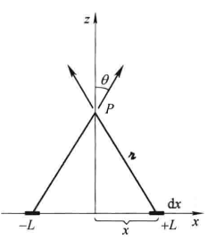

# 电动力学导论

一个长度为$2L$的细杆均匀带电，电荷线密度为$\lambda$，求出垂直于杆且与杆中心距离为$z$处的电场

**解答**
易知，由对称关系，水平方向上的电场强度将被抵消.
以细杆中心为原点，有：
$$\begin{align}\boldsymbol{E} &= 2\int_0^{L}\frac{1}{4\pi\epsilon_0}\frac{\lambda}{r^2}\cos\theta\mathrm{d}l\cdot\boldsymbol{z}\\&=\frac{\lambda}{2\pi\epsilon_0}\int_0^L\frac{\cos\theta}{r^2}\mathrm{d}l\cdot\boldsymbol{z}\end{align}$$
$$l = z\tan\theta\Rightarrow\mathrm{d}l = z\sec^2\theta$$
$$\begin{cases}l = 0\rightarrow\theta = 0\\l = L\rightarrow \theta = \theta_{Max}\end{cases}$$
$$r = \frac{z}{\cos\theta}$$
$$\cos\theta = \frac{z}{r} = \frac{z}{\sqrt{x^2 + z^2}}$$
$$\begin{align}\boldsymbol{E} &= \frac{\lambda}{2\pi\epsilon_0}\int_0^{\theta_{Max}}\frac{\cos^3\theta}{z^2}\cdot z\sec^2\theta\mathrm{d}\theta\cdot\boldsymbol{z}\\&=\frac{\lambda}{2\pi\epsilon_0}\frac{\sin\theta_{Max}}{z}\boldsymbol{z}\\&=\frac{\lambda}{2\pi\epsilon_0}\frac{L}{z\sqrt{L^2 + z^2}}\boldsymbol{z}\end{align}$$
电场方向沿$\boldsymbol{z}$方向，$\lambda$为正时向上，反之向下